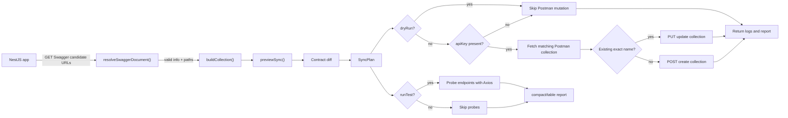

# NestJS Swagger Sync

Turn your NestJS Swagger/OpenAPI docs into a Postman collection, probe every endpoint live, and sync the result to Postman. Works on Express and Fastify, NestJS 6 through 12, with dual ESM and CommonJS output.

## What it does

1. Fetches your app Swagger JSON from `${baseUrl}/${swaggerPath}-json`, falling back to `${baseUrl}/${swaggerPath}/json`.
2. Builds a hierarchical Postman collection from it (folders follow URL path segments).
3. Probes every endpoint live against `baseUrl` and prints a test report with status, latency, and response size.
4. Creates or updates the matching Postman collection by exact name.

## How it works



The plugin consumes the Swagger JSON you already serve (for example with `@nestjs/swagger`). It does not regenerate your API docs. Probing uses `axios` directly, no Newman or CLI dependency.

## Requirements

- Node.js `>=20.19.0` (developed on Node 24)
- NestJS `>=6.0.0` with `@nestjs/platform-express` or `@nestjs/platform-fastify`
- A Postman account and API key
- Swagger JSON reachable at `${baseUrl}/${swaggerPath}-json`

## Installation

```bash
npm install nestjs-swagger-sync
yarn add nestjs-swagger-sync
pnpm add nestjs-swagger-sync
```

Peer dependencies (already present in any NestJS project):

- `@nestjs/common >=6.0.0`
- `@nestjs/core >=6.0.0`
- `reflect-metadata >=0.1.13`
- `rxjs >=6.0.0`

Runtime dependencies: `axios ^1.20.0`, `chalk ^4.1.2`, `cli-table3 ^0.6.5`.

## Quick start

Step 1, register the module. It is `@Global()`, so `SwaggerSyncService` is injectable anywhere without re-importing:

```typescript
import { Module } from '@nestjs/common';
import { SwaggerSyncModule } from 'nestjs-swagger-sync';

@Module({
  imports: [
    SwaggerSyncModule.register({
      apiKey: process.env.POSTMAN_API_KEY ?? '',
      swaggerPath: 'swagger',
      baseUrl: 'http://localhost:3000',
    }),
  ],
})
export class AppModule {}
```

Step 2, trigger a sync from an endpoint, a script, or a job:

```typescript
import { Controller, Post } from '@nestjs/common';
import { SwaggerSyncService } from 'nestjs-swagger-sync';

@Controller('admin')
export class AdminController {
  constructor(private readonly sync: SwaggerSyncService) {}

  @Post('sync-postman')
  async sync() {
    await this.sync.syncSwagger();
    return { ok: true };
  }
}
```

Step 3, run it:

```bash
curl -X POST http://localhost:3000/admin/sync-postman
```

You will see the Swagger fetch log, the API test report, and the Postman upload result in the terminal.

CommonJS consumers:

```typescript
const { SwaggerSyncModule } = require('nestjs-swagger-sync');
```

## Configuration reference

```typescript
SwaggerSyncModule.register({
  // Required
  apiKey: process.env.POSTMAN_API_KEY ?? '',
  swaggerPath: 'swagger',
  baseUrl: 'http://localhost:3000',
  // Optional
  collectionName: 'My API',
  runTest: true,
  ignorePathWithBearerToken: [],
  dryRun: false,
  outputMode: 'compact',
});
```

| Option | Type | Required | Default | Description |
|--------|------|----------|---------|-------------|
| apiKey | string | Yes | - | Postman API key. Empty string skips the upload; fetch, build, and tests still run. |
| swaggerPath | string | Yes | - | Path segment. The plugin tries `${baseUrl}/${swaggerPath}-json`, then `${baseUrl}/${swaggerPath}/json`; pass `'swagger'` for the standard Nest Swagger setup. |
| baseUrl | string | Yes | - | Base URL of your API. Must be a valid absolute URL. |
| collectionName | string | No | Swagger `info.title`, else `API Collection` | Postman collection name. |
| runTest | boolean | No | `true` | Probe collection endpoints before upload. |
| ignorePathWithBearerToken | string[] | No | `[]` | Exact-match paths excluded from the collection and tests. |
| dryRun | boolean | No | `false` | Build and optionally test the collection without calling Postman. |
| outputMode | `'compact' \| 'table'` | No | `'compact'` | Endpoint report style. `table` shows the legacy wide report and statistics. |

`POSTMAN_API_KEY` and `API_BASE_URL` are suggested env names only. The module reads only what you pass in.

## Every option explained

### apiKey

Your Postman API key (Postman, workspace settings, API Keys). An empty string skips the upload with a warning and returns `false` from the upload step without calling the Postman API. Best practice is env loading, never hard-coding:

```typescript
apiKey: process.env.POSTMAN_API_KEY ?? '',
```

### baseUrl

The URL probed during tests, the `baseUrl` collection variable, and part of the Swagger fetch URL. Must parse with `new URL()` and include a hostname, otherwise `register()` throws `Invalid base URL: <x>` at construction:

```typescript
baseUrl: process.env.API_BASE_URL ?? 'http://localhost:3000',
```

### swaggerPath

The base segment of your OpenAPI JSON endpoint. The plugin tries `${baseUrl}/${swaggerPath}-json`, then `${baseUrl}/${swaggerPath}/json`, and reports every attempted URL if neither returns a valid Swagger document:

```typescript
// SwaggerModule.setup('swagger', app, document) -> swaggerPath: 'swagger'
// SwaggerModule.setup('api', app, document)      -> swaggerPath: 'api'
swaggerPath: 'api',
```

### collectionName

Overrides the name. Matching against existing Postman collections is exact:

```typescript
collectionName: 'Rentalmu API v2',
```

### runTest

Live probes before upload. Each endpoint in the built collection is requested and the report shows status, latency, and size:

```typescript
runTest: true,
```

### ignorePathWithBearerToken

Exact-match Swagger path keys to fully exclude. Matching normalizes leading slashes on both sides, so `/auth/login` matches `auth/login`, but `'/auth/login'` does not match `'/api/v1/auth/login'` (use the full path from your OpenAPI `paths`):

```typescript
ignorePathWithBearerToken: ['/auth/login', '/auth/refresh', '/health'],
```

### dryRun

Builds the collection and optionally runs endpoint tests, then skips all Postman API calls. Useful for local checks and CI:

```typescript
dryRun: true,
```

### outputMode

Controls the test report:

```typescript
outputMode: 'compact', // default, one concise line per request
outputMode: 'table',   // wide table with aggregate statistics
```

### buildCollection()

Build a typed `PostmanCollection` without fetching or uploading:

```typescript
const collection = service.buildCollection(swaggerDocument);
```

The method accepts a validated Swagger document returned by your OpenAPI setup. Ignored paths are excluded from the returned collection.

## Usage patterns

Manual trigger via HTTP (most common): expose a protected admin endpoint as in Quick start and call it after API changes.

Auto-sync on boot (development only):

```typescript
import { Injectable, OnModuleInit } from '@nestjs/common';
import { SwaggerSyncService } from 'nestjs-swagger-sync';

@Injectable()
export class BootstrapSync implements OnModuleInit {
  constructor(private readonly sync: SwaggerSyncService) {}

  async onModuleInit() {
    if (process.env.NODE_ENV !== 'production') {
      await this.sync.syncSwagger();
    }
  }
}
```

Scheduled sync with `@nestjs/schedule`:

```typescript
import { Injectable } from '@nestjs/common';
import { Cron, CronExpression } from '@nestjs/schedule';
import { SwaggerSyncService } from 'nestjs-swagger-sync';

@Injectable()
export class SyncJob {
  constructor(private readonly sync: SwaggerSyncService) {}

  @Cron(CronExpression.EVERY_DAY_AT_MIDNIGHT)
  syncPostman() {
    return this.sync.syncSwagger();
  }
}
```

Concurrent `syncSwagger()` calls are safe: a second call returns immediately while one is in flight.

## Express vs Fastify

The plugin is platform agnostic. Only your Swagger setup differs. Set `swaggerPath` to match `SwaggerModule.setup()`:

```typescript
// main.ts, either adapter
const document = SwaggerModule.createDocument(app, config);
SwaggerModule.setup('swagger', app, document); // serves /swagger-json

SwaggerSyncModule.register({
  swaggerPath: 'swagger', // -> GET ${baseUrl}/swagger-json
  baseUrl: 'http://localhost:3000',
  apiKey: process.env.POSTMAN_API_KEY ?? '',
});
```

## Terminal output and notifications

`outputMode: 'compact'` prints one short line per request plus totals:

```text
API tests http://localhost:3000
[PASS] GET http://localhost:3000/users [200 | 12ms | 24.00 Bytes]
1 requests: 1 passed, 0 failed (0.01s, avg 12.00ms, 24.00 Bytes)
Tests completed.
```

`outputMode: 'table'` prints the wide report with method, URL, status, response time, result, totals, and aggregate statistics.

Notifications include:

- `Postman API key detected, collection will sync to Postman.`
- `No Postman API key (apiKey is empty). Upload will be skipped.`
- `[dryRun] Skipping upload to Postman.`
- `Creating new collection on Postman...`
- `Updating existing collection: ...`
- `Collection created on Postman: ...`
- `Collection updated on Postman: ...`
- `Collection upload failed, check your Postman API key and network: ...`

## Programmatic API

`SwaggerSyncService.syncSwagger(): Promise<void>` runs the full pipeline. Safe to `await` from controllers, cron, or bootstrap. Errors are logged, not rethrown, so the promise resolves after logging.

`SwaggerSyncService.buildCollection(swaggerDocument)` builds a `PostmanCollection` without fetching or uploading. Pass a validated document with `info` and `paths`.

`SwaggerSyncService.previewSync(): Promise<SyncPlan>` fetches Swagger and the current matching Postman collection, computes contract changes, and never POSTs or PUTs to Postman:

```typescript
const plan = await sync.previewSync();

console.log(plan.counts);
for (const change of plan.changes) {
  console.log(change.severity, change.method, change.path, change.summary);
}
```

Change severities are `safe`, `review`, and `breaking`. The first release is advisory: `syncSwagger()` remains backward-compatible and does not block existing callers.
Exported names:

```typescript
import {
  ApiTestService,
  SwaggerSyncModule,
  SwaggerSyncService,
  SWAGGER_SYNC_OPTIONS,
} from 'nestjs-swagger-sync';
import type {
  ApiTestOutputMode,
  ContractChange,
  PostmanCollection,
  PostmanEndpoint,
  PostmanFolder,
  CollectionNode,
  SyncPlan,
  SwaggerDocument,
  SwaggerSyncConfig,
} from 'nestjs-swagger-sync';
```

`SwaggerSyncModule` is a `@Global()` dynamic module with a static `register(options)` method. Both `import` (ESM, `./dist/index.js`) and `require()` (CJS, `./dist/index.cjs`) work, with matching `.d.ts` / `.d.cts` types.

## Error handling and troubleshooting

- `Invalid base URL: <x>` at startup. Cause: `baseUrl` is not a valid absolute URL. Fix: use `http://host:port` form.
- `Invalid Swagger document received from <url>`. Cause: the fetched JSON has no usable `info`/`paths`. Fix: check `swaggerPath` and that the app serves Swagger JSON.
- `Unable to fetch Swagger document from <baseUrl>. Tried: <urls>`. Cause: neither Swagger candidate URL returned a valid document. Fix: verify `swaggerPath` and that the app serves `-json` or `/json`.
- `No Postman API key provided (apiKey is empty). Skipping upload.` Cause: empty `apiKey`. Not an error: fetch, build, and tests still run. Fix: set the key to upload.
- `Postman API authentication failed (HTTP 401/403).` Cause: bad or expired key. Fix: regenerate the key in Postman.
- `Failed to fetch Postman collections: HTTP <status>.` Cause: Postman list call failed. Fix: check key and network.
- `Postman API returned HTTP <status> for PUT/POST <url>`. Cause: collection write rejected. Fix: inspect key, workspace access, and network.
- Endpoint missing from collection and tests. Cause: listed in `ignorePathWithBearerToken`. Fix: remove it from the list or use the full OpenAPI path.

## Compatibility

Verified on Node 24, **28/28 passing** — NestJS 6.10.14, 7.6.18, 8.4.7, 9.4.3, 10.4.22, 11.2.7, 12.1.2, each on Express and Fastify, each as ESM and CommonJS. Every case installs the packed tarball with isolated dependencies, boots a real Nest app over HTTP, resolves `SwaggerSyncService` through DI, generates Swagger, and verifies a contract preview. Package `engines` requires Node `>=20.19.0`.

Distribution: `type: module` with `./dist/index.js` (ESM) and `./dist/index.cjs` (CJS), types split per `import`/`require` condition. The published tarball contains only `dist/*`, `README.md`, `LICENSE`, and `package.json`.

## Local development

```bash
pnpm install --frozen-lockfile
pnpm run build      # tsdown dual ESM/CJS plus declarations
pnpm run typecheck  # strict NodeNext tsc
pnpm run lint       # Oxlint
pnpm run format     # Oxfmt
pnpm run test       # Vitest unit plus integration
pnpm run test:e2e   # E2E over real HTTP
pnpm run check      # typecheck plus lint plus format check plus build plus test
```

## Contributing

1. Fork the repo.
2. `git checkout -b feature/your-feature`.
3. `pnpm install && pnpm run check`.
4. Commit and push, then open a pull request. Keep changes local until you are ready to share.

## License

MIT, see `LICENSE`.

## Support

- Issues: `https://github.com/garsetayusuf/nestjs-swagger-sync/issues`
- Postman API keys: Postman workspace settings, API Keys section.
